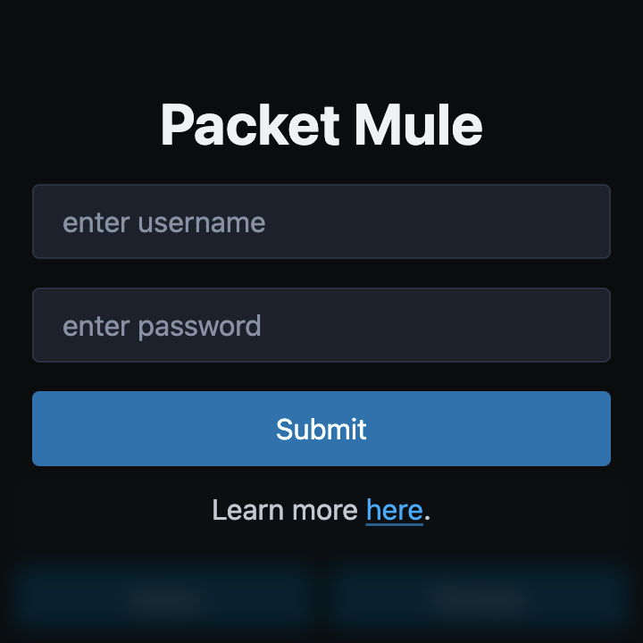
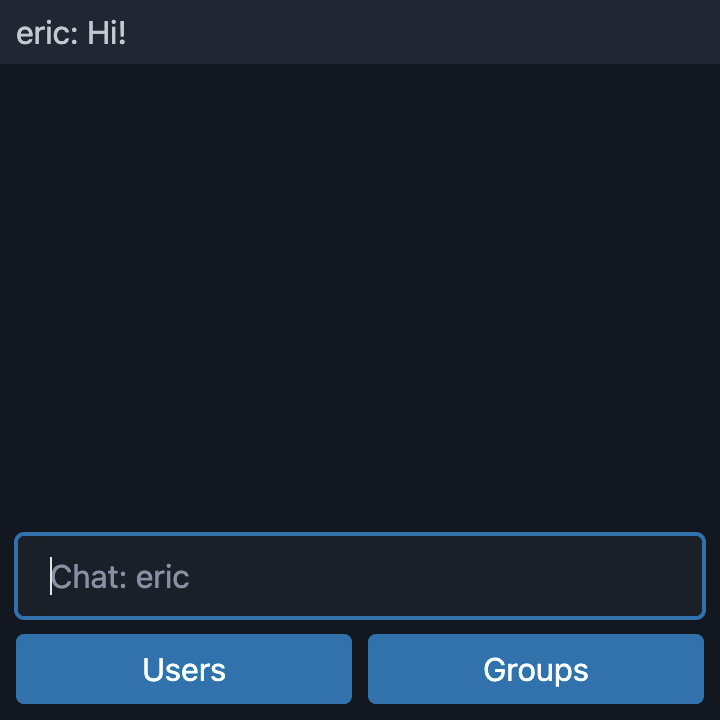

# Packet Mule



Packet Mule is a web-based tool to simplify network communication in Cycling 74's [Max](https://cycling74.com/products/max). It is especially useful for remote communication, in-patch chat, or situations where OSC may not be viable (e.g. a public or institutional network where OSC is blocked).

It's not a library or a package - there's nothing to install on the client (other than Max), though you may want to download the [pm-demo.maxpat](pm-demo.maxpat) file.

## Deploy your own Packet Mule server

Due to data and bandwidth limitations, Packet Mule currently requires deploying your own server. The instructions below apply to [Render](https://render.com), though any platform that supports Node.js web services (e.g. [Fly.io](https://fly.io), [Google Cloud](https://cloud.google.com/appengine/docs/standard/nodejs/building-app), [Heroku](https://www.heroku.com)) will work. The monthly allocations on Render's free tier should be sufficient for a group of up to 20 members. _Be aware that a server deployed on the free tier may take up to a minute to restart after a period of inactivity._

### From the public repository

1. Create a [Render](https://render.com) account if needed and sign in. You can optionally sign in using your GitHub account (recommended).
2. In your Render dashboard, click "New +" and choose "Web Service".
3. Select "Build and deploy from a Git repository".
4. On the following page, copy-paste the [url of this repository](https://github.com/ersheff/Packet-Mule) in the "Public Git repository" field and click "Connect".
5. Continue with the [Additional settings](#additional-settings) instructions below.

### From a fork

1. [Create a fork](https://docs.github.com/en/pull-requests/collaborating-with-pull-requests/working-with-forks/fork-a-repo) of this repository in your own GitHub account.
2. Sign in to [Render](https://render.com) using GitHub.
3. In your Render dashboard, click "New +" and choose "Web Service".
4. Select "Build and deploy from a Git repository".
5. On the following page, you should find an entry for "Packet-Mule" under "Connect a repository". If you do, click "Connect". If you do not, then there may be an issue with permissions between Render and GitHub.
6. Continue with the [Additional settings](#additional-settings) instructions below.

### Additional settings

The next page will ask for additional information about your web service deployment. If you intend to use Render's free tier, make sure that you select "Free" under "Instance Type". Otherwise, you can optionally change the following before clicking "Create Web Service" to finish:

- Name (this will determine your server's url)
- Region (choose the one closest to you)
- Environment Variables (used to set a password, see additional details [below](#setting-a-password))

#### Setting a password

Although Packet Mule does not transmit any sensitive information, you may want to set a password to limit access to your server. This is mostly to prevent unwanted traffic that might interrupt your performance or eat into your data and bandwidth limits. Packet Mule is set up to store either a plain text password or an encrypted password using [bcrypt](https://en.wikipedia.org/wiki/Bcrypt#:~:text=bcrypt%20is%20a%20password%2Dhashing,presented%20at%20USENIX%20in%201999.).

- To use a plain text password, enter `PLAIN_PWD` as the name of the environment variable and your desired password as the value.
- To use an encrypted password, enter `HASHED_PWD` as the name of the environment variable and the hashed version of your desired password as the value. A hashed version can be generated using the bcrypt library in [Node.js](https://www.npmjs.com/package/bcrypt) or [Python](https://pypi.org/project/bcrypt/), though you can also try using an [online hash generator](https://bcrypt-generator.com).

## Using Packet Mule in Max



- Launch your Packet Mule server's url in a jweb object in Max.
- If your username and password are accepted, the jweb window will load a basic chat application.
- Outgoing messages can be sent to the inlet of the jweb object in the format:

```
pm target header data...
```

- `target` can either be "all" (to send to everyone), the username of another connected user, or a [group](#groups) name.
- `header` can be any message header that you want e.g. volume, pitch, cue, etc. It should be a single word without spaces - otherwise, your message will be received in an unexpected format.
- `data...` can be a Max list comprised of one or more integers, floats, symbols, or any combination thereof.
- Incoming messages are received at the jweb object's outlet in the format:

```
source header data...
```

## Using Packet Mule on a phone

The Packet Mule phone client is intended to send basic control data (accelerometer, gyroscope, and 2 sliders) from a user's phone to their own laptop.

- Launch your Packet Mule server's url in the browser on your phone. Tap "Phone" when prompted to choose an interface.
- Choose your username (the one that you are using in the Max client) from the dropdown menu.
- Phone sensor data is received at the jweb object's outlet in the format:

```
phone accelX accelY accelZ yaw pitch roll slider1 slider2
```

## Using Packet Mule in a browser

Though not the intended purpose, you can launch Packet Mule in a browser to have access to chat and monitor Max or phone messages.

## Groups

Clicking the "Groups" button in the Max or browser client will open a separate window to create and join groups. Groups are used to send messages to a group of people withouth sending to "all". For example, if your ensemble is performing a piece with different parts, you may want to create a group for each part.

- To create a group, enter the desired group name in the text field as a single word without spaces.
- To join or leave an existing group, check or uncheck the box next to the group name.
- Groups are deleted automatically once there is no longer anyone in the group.
- To send messages to a group, use the group name as the target in your Max message:

```
pm groupname header data...
```

- When receiving messages in a group, the source will be the group name instead of the individual sender:

```
groupname header data...
```

## Optional url parameters

To save time, you can optionally add parameters to the end of the url to load Packet Mule with preselected settings (replacing "username" or "password" with your own values).

- `?user=username` - (load with chosen username)
- `?pass=password` - (bypass password prompt)
- `?phone` - (load the phone interface automatically without being prompted)
- `?phone=username` - (load the phone interface with a preselected Max or browser target)

You can chain parameters with `&`. For example:

```
https://your-server-url.com/?user=eric&pass=123
```

will automaticaly load the client with the username "eric" (assuming that the username is available and the password is correct). If any of the parameters are invalid (e.g. a username that is not available or an incorrect password), you will see the standard username or password prompts.

## Other details

- Outgoing messages are limited to a speed of 20 messages per second (every 50ms). If more than one message is attempted within that 50ms window, they are gathered into a single "payload" for transmission at the next interval.
- The payload is cleared after every outgoing transmission, and nothing is sent again until new messages are put in the queue.
- To eliminate redundnancy, if more than one message with the same `target` and `header` pair is attempted within the 50ms window, only the last one will be sent.
